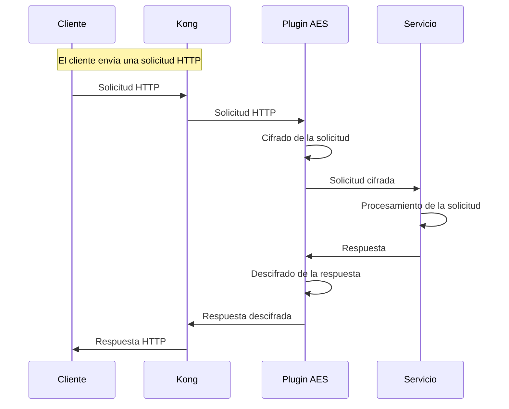

# Kong Plugin AES Encryption

Este proyecto es un plugin para Kong que proporciona capacidades de cifrado y descifrado AES. Está diseñado para integrarse con Kong y permitir el cifrado de solicitudes y el descifrado de respuestas utilizando el algoritmo AES-256-CBC.

## Estructura del Proyecto

```
.
├── Dockerfile
├── api.lua
├── docker-compose.yml
├── handler.lua
├── init.lua
├── kong-plugin-aes
├── kong-plugin-aes-crypto-0.1.0-1.rockspec
└── schema.lua
```

### Descripción de Archivos

- **Dockerfile**: Define la imagen de Docker para construir el entorno de Kong con el plugin de cifrado AES.
- **docker-compose.yml**: Configura los servicios necesarios para ejecutar Kong, incluyendo la base de datos PostgreSQL y la interfaz de administración Konga.
- **api.lua**: Define el endpoint del plugin para la administración a través de la API de Kong.
- **handler.lua**: Contiene la lógica principal del plugin para manejar el cifrado y descifrado de datos.
- **init.lua**: Inicializa el plugin y define su comportamiento durante las fases de acceso y filtrado de cuerpo.
- **schema.lua**: Define el esquema de configuración del plugin, incluyendo las claves de cifrado y las opciones de configuración.
- **kong-plugin-aes-crypto-0.1.0-1.rockspec**: Archivo de especificación de LuaRocks para la instalación del plugin.
- **kong-plugin-aes**: Directorio que contiene el código fuente del plugin.

## Instalación

1. **Clonar el repositorio**:
   ```
   git clone https://github.com/dablon/kong-plugin-aes.git
   cd kong-plugin-aes
   ```

2. **Construir la imagen de Docker**:
   ```
   docker-compose build
   ```

3. **Iniciar los servicios**:
   ```
   docker-compose up
   ```

## Configuración

El plugin se configura a través de la API de Kong. Los parámetros de configuración incluyen:

- `encrypt_request`: Booleano para habilitar el cifrado de solicitudes.
- `decrypt_response`: Booleano para habilitar el descifrado de respuestas.
- `encryption_key`: Clave de cifrado AES.
- `encryption_iv`: Vector de inicialización para el cifrado AES.

## Paso a Paso para Probar el Plugin

1. **Verificar que los servicios estén corriendo**:
   Asegúrate de que los servicios de Kong y Konga estén activos. Puedes verificarlo accediendo a `http://localhost:8001` para Kong y `http://localhost:1337` para Konga.

2. **Acceder a Konga**:
   Abre `http://localhost:1337` en tu navegador para acceder a la interfaz de administración de Konga.

3. **Configurar un Servicio y una Ruta en Kong**:
   - Crea un nuevo servicio en Konga apuntando a un backend de prueba.
   - Configura una ruta para el servicio creado.

4. **Activar el Plugin en la Ruta**:
   - En Konga, navega a la sección de plugins de la ruta configurada.
   - Añade el plugin `aes-crypto` y configura los parámetros necesarios (`encryption_key` y `encryption_iv`).

5. **Probar el Cifrado y Descifrado**:
   - Envía una solicitud HTTP al endpoint configurado y verifica que el cuerpo de la solicitud se cifre.
   - Verifica que la respuesta se descifre correctamente.

6. **Revisar los Logs**:
   - Utiliza los logs de Kong para verificar que el plugin está funcionando como se espera. Los logs pueden proporcionar información sobre cualquier error o advertencia.

## Diagrama de Secuencia




## Contribuciones

Las contribuciones son bienvenidas. Por favor, abre un issue o un pull request en el repositorio de GitHub.
